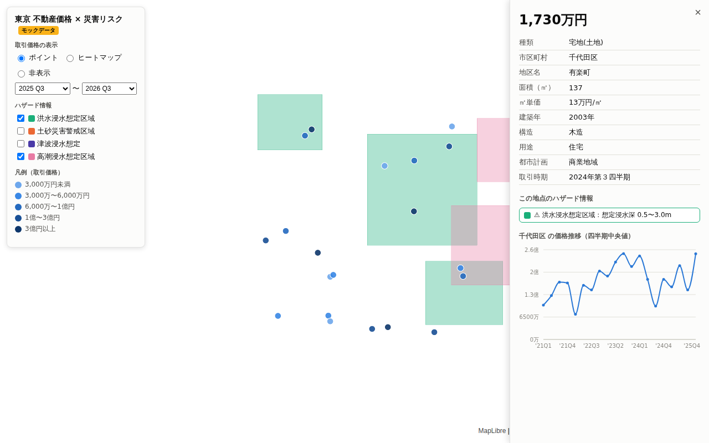

# 東京 不動産価格 × 災害リスク マップ

[不動産情報ライブラリ（国土交通省）](https://www.reinfolib.mlit.go.jp/) のAPIを使い、東京都の不動産取引価格を地図上に可視化し、災害リスク（洪水・土砂・津波・高潮）と価格推移を重ねて見られるWebアプリです。



## 機能

- **価格マップ**: 取引価格ポイントを価格5段階で色分け表示（ポイント⇔ヒートマップ切替、期間指定）
- **ハザードレイヤー**: 災害リスク区域を半透明ポリゴンで重ね合わせ（レイヤーごとにON/OFF）
- **地点詳細**: ポイントをクリックすると取引詳細・その地点のハザード該当状況・市区町村の価格推移チャート（四半期中央値）を表示

## セットアップ

必要: Node.js 20+

```bash
npm install
npm run dev   # サーバー(:8787) + クライアント(:5173) を同時起動
```

http://localhost:5173 を開いてください。

### モックモードと実APIモード

**APIキーなしでもそのまま動きます。** `REINFOLIB_API_KEY` が未設定だとサーバーは自動的に**モックモード**になり、`server/fixtures/` の架空データ（千代田区周辺の取引20件・架空のハザード区域）で全機能が動作します。画面左上に「モックデータ」バッジが表示されます。

実データを使うには:

1. [API利用申請](https://www.reinfolib.mlit.go.jp/api/request/)（無料、審査 約5営業日）でAPIキーを取得
2. `.env.example` を `.env` にコピーして `REINFOLIB_API_KEY` を設定
3. `npm run dev` を再起動

APIキーはサーバー側プロキシだけが保持し、ブラウザには渡りません。レスポンスは24時間キャッシュされます。

### ⚠️ ハザードレイヤーの実API接続について

ハザード系（洪水・土砂・津波・高潮）の reinfolib APIコード（XKT番号）は未確定のため、`server/src/config/layers.ts` で `apiCode: null` になっています。実モードでこれらのレイヤーは 501 を返します（モックモードでは動作します）。

接続するには [公式APIマニュアル](https://www.reinfolib.mlit.go.jp/help/apiManual/) で該当APIの番号・パラメータを確認し、`layers.ts` の `apiCode` と `allowedParams` を埋めてください。APIコードを記述してよいのはこのファイルだけです（詳細は `PLAN.md` §3 参照）。

## コマンド

| コマンド | 内容 |
|---|---|
| `npm run dev` | 開発サーバー起動（server + client） |
| `npm test` | 全テスト実行（server 28件 + client 18件） |
| `npm run build` | 型チェック + 本番ビルド |
| `npm run lint` | ESLint |

## 構成

```
server/   Hono プロキシ（APIキー秘匿・LRUキャッシュ・モックモード）
  src/config/layers.ts   レイヤーレジストリ（reinfolib APIコードの唯一の記述場所）
  fixtures/              モックデータ（架空。実在の物件・区域ではありません）
client/   Vite + React + MapLibre GL JS + Recharts
```

アーキテクチャと実装計画の詳細は [PLAN.md](PLAN.md) を参照してください。

## データ出典

- [不動産情報ライブラリ（国土交通省）](https://www.reinfolib.mlit.go.jp/)
- [地理院タイル（国土地理院）](https://maps.gsi.go.jp/development/ichiran.html)
